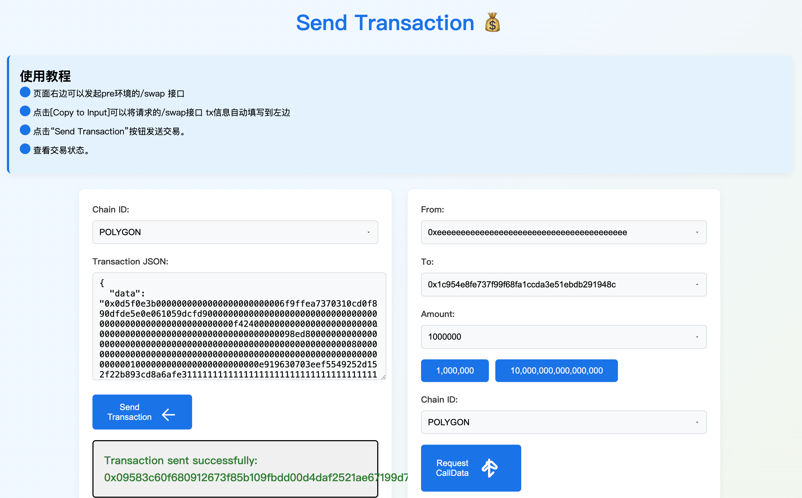

# 项目使用方法

## 1. 安装依赖

1. 安装 Homebrew（如已安装可跳过）  
   `/bin/bash -c "$(curl -fsSL https://raw.githubusercontent.com/Homebrew/install/HEAD/install.sh)"`

2. 通过 Homebrew 安装 Node.js  
   `brew install node`

3. 验证 Node.js 和 npm 是否安装成功  
   `node -v`  
   `npm -v`

4. 安装项目依赖（推荐使用 yarn）  
   `yarn install`

## 2. 最新脚本 V1.0

最新版本已全面支持 Solana 和 SUI Chain。请按以下步骤操作： 

>  1. 运行 `send-tx-demo-v1.js` 
>  2. 请务必正确配置各链的 `XXX_PRIVATE_KEY`。
>  3. 在 `display-index` 的 `callDataUrl` 中配置请求地址：**`url`**
> 4. 若需发送 Tron 交易，请配置 **`TRON_PRIVATE_KEY`** 及 **`trongrid ApiKey`**
> 5. `url` 中的 `user` 参数请替换为您自己的钱包地址
> 6. 若涉及 Solana 交易，请前往 [Helius Dashboard](https://dashboard.helius.dev/) 申请节点

## 3. 示例效果

---
> 💡 **如有疑问，欢迎查阅文档或联系 Ferris 获取支持。**
--- 